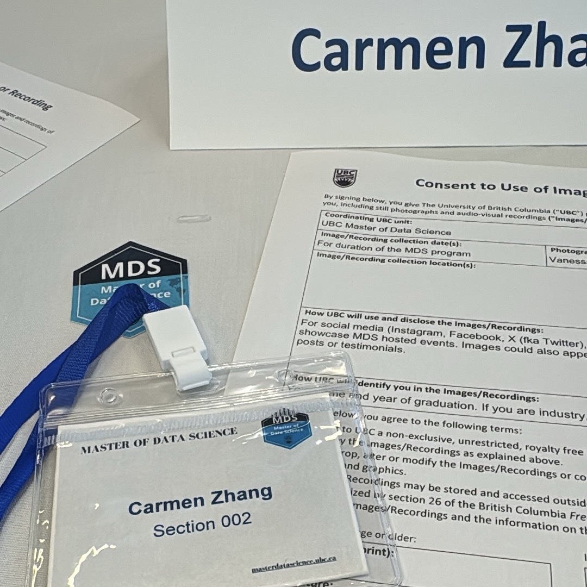

My first few weeks in the MDS program have been a great experience so far. The professors and TAs have been very friendly and supportive, and I really appreciate how clearly the courses are organized. The instructions for lectures, worksheets, and lab assignments are easy to follow, which has made it much easier to adjust to the pace of the program.

Because of my undergraduate background in Computer Science and Statistics at UBC, much of the material so far has felt like a helpful review. We have been reviewing Python and R, as well as some fundamental concepts in statistics and probability. I think the current pace is a good fit for me because it gives me an opportunity to refresh what I already know while gradually getting used to the structure and workload of MDS.

Looking ahead, I am excited to learn more advanced topics and gain deeper knowledge in data science. I also hope there will be more opportunities to work on hands-on projects where I can apply what I learn to practical problems. Building more projects throughout the program would not only help me develop my skills, but also allow me to strengthen my portfolio and resume as I prepare for future career opportunities.

